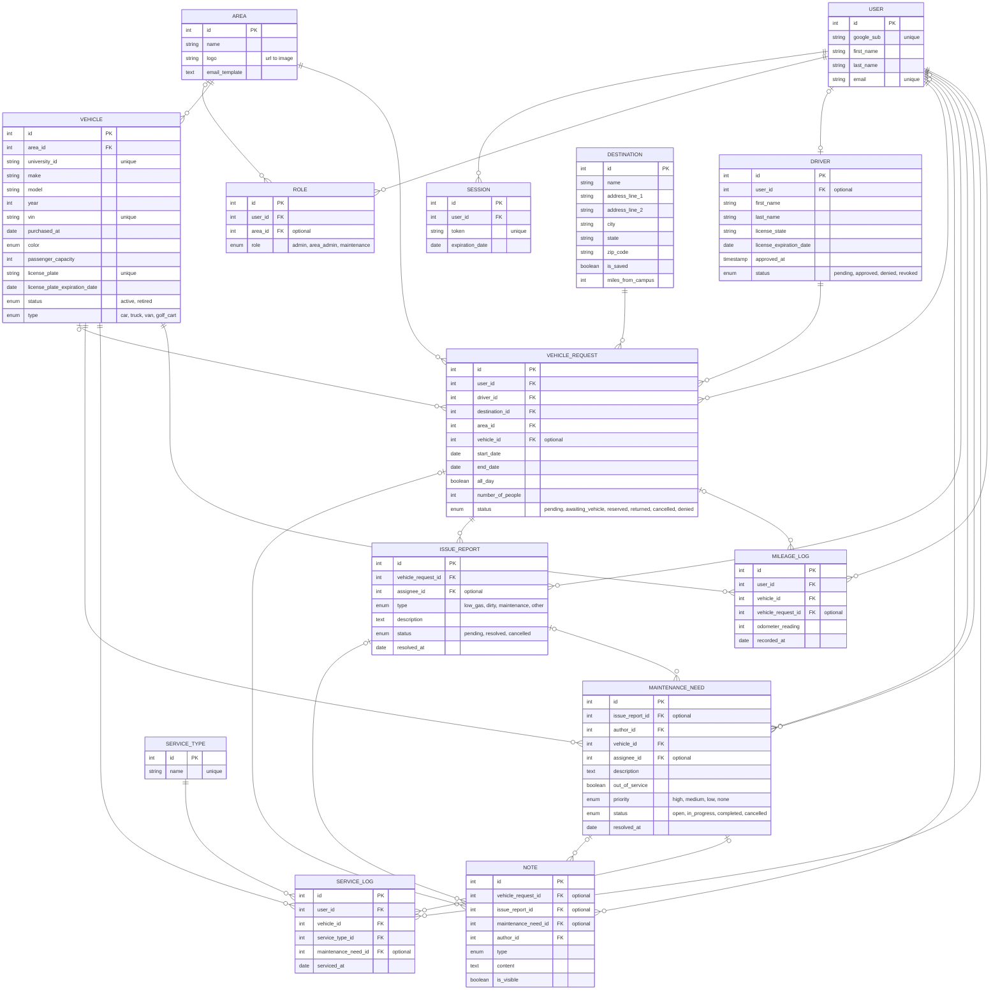

```mermaid
erDiagram

    USER ||--o{ SESSION : " "
    USER ||--o{ ROLE : " "
    USER |o--o| DRIVER : " "
    AREA |o--o{ ROLE : " "
    AREA ||--o{ VEHICLE : " "
    USER ||--o{ VEHICLE_REQUEST : " "
    DRIVER ||--o{ VEHICLE_REQUEST : " "
    DESTINATION ||--o{ VEHICLE_REQUEST : " "
    VEHICLE |o--o{ VEHICLE_REQUEST : " "
    AREA ||--o{ VEHICLE_REQUEST : " "
    VEHICLE_REQUEST |o--o{ NOTE : " "
    ISSUE_REPORT |o--o{ NOTE : " "
    MAINTENANCE_NEED |o--o{ NOTE : " "
    USER ||--o{ NOTE : " "
    VEHICLE_REQUEST ||--o{ ISSUE_REPORT : " "
    USER |o--o{ ISSUE_REPORT : " "
    ISSUE_REPORT |o--o{ MAINTENANCE_NEED : " "
    USER ||--o{ MAINTENANCE_NEED : " "
    USER |o--o{ MAINTENANCE_NEED : " "
    VEHICLE ||--o{ MAINTENANCE_NEED : " "
    USER ||--o{ SERVICE_LOG : " "
    VEHICLE ||--o{ SERVICE_LOG : " "
    SERVICE_TYPE ||--o{ SERVICE_LOG : " "
    MAINTENANCE_NEED |o--o{ SERVICE_LOG : " "
    USER ||--o{ MILEAGE_LOG : " "
    VEHICLE ||--o{ MILEAGE_LOG : " "
    VEHICLE_REQUEST |o--o{ MILEAGE_LOG : " "

    USER {
      int id PK
      string google_sub "unique"
      string first_name
      string last_name
      string email "unique"
    }

    SESSION {
      int id PK
      int user_id FK
      string token "unique"
      date expiration_date
    }

    ROLE {
      int id PK
      int user_id FK
      int area_id FK "optional"
      enum role "admin, area_admin, maintenance"
    }

    DRIVER {
      int id PK
      int user_id FK "optional"
      string first_name
      string last_name
      string license_state
      date license_expiration_date
      timestamp approved_at
      enum status "pending, approved, denied, revoked"
    }

    DESTINATION {
      int id PK
      string name
      string address_line_1
      string address_line_2
      string city
      string state
      string zip_code
      boolean is_saved
      int miles_from_campus
    }

    AREA {
      int id PK
      string name
      string logo "url to image"
      text email_template
    }

    VEHICLE {
      int id PK
      int area_id FK
      string university_id "unique"
      string make
      string model
      int year
      string vin "unique"
      date purchased_at
      enum color
      int passenger_capacity
      string license_plate "unique"
      date license_plate_expiration_date
      enum status "active, retired"
      enum type "car, truck, van, golf_cart"
    }

    VEHICLE_REQUEST {
      int id PK
      int user_id FK
      int driver_id FK
      int destination_id FK
      int area_id FK
      int vehicle_id FK "optional"
      date start_date
      date end_date
      boolean all_day
      int number_of_people
      enum status "pending, awaiting_vehicle, reserved, returned, cancelled, denied"
    }

    NOTE {
      int id PK
      int vehicle_request_id FK "optional"
      int issue_report_id FK "optional"
      int maintenance_need_id FK "optional"
      int author_id FK
      enum type
      text content
      boolean is_visible
    }

    ISSUE_REPORT {
      int id PK
      int vehicle_request_id FK
      int assignee_id FK "optional"
      enum type "low_gas, dirty, maintenance, other"
      text description
      enum status "pending, resolved, cancelled"
      date resolved_at
    }

    MAINTENANCE_NEED {
      int id PK
      int issue_report_id FK "optional"
      int author_id FK
      int vehicle_id FK
      int assignee_id FK "optional"
      text description
      boolean out_of_service
      enum priority "high, medium, low, none"
      enum status "open, in_progress, completed, cancelled"
      date resolved_at
    }

    SERVICE_TYPE {
      int id PK
      string name "unique"
    }

    SERVICE_LOG {
      int id PK
      int user_id FK
      int vehicle_id FK
      int service_type_id FK
      int maintenance_need_id FK "optional"
      date serviced_at
    }

    MILEAGE_LOG {
      int id PK
      int user_id FK
      int vehicle_id FK
      int vehicle_request_id FK "optional"
      int odometer_reading
      date recorded_at
    }


```
